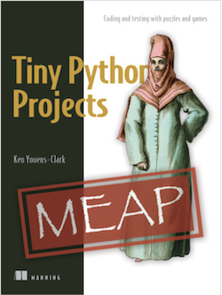

= Teaching test-driven development with pytest

This is my presentation for the https://remote.python.pizza/[remote.python.pizza] online conference 25 April 2020.
The "presentation" directory contains a PPT and PDF of the slides, and the "code" directory contains a working example of how I would present program specifications (`README.adoc`), tests (`test.py`), and a framework for running the tests (using `pytest` and a `Makefile`).

I explore these ideas in much greater detail in my book, https://www.manning.com/books/tiny-python-projects?a_aid=youens&a_bid=b6485d52[Tiny Python Projects].

= Author

Ken Youens-Clark <kyclark@gmail.com>
